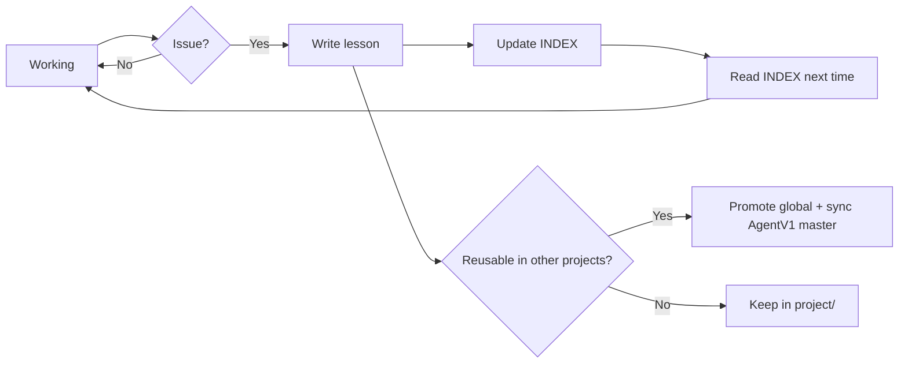

# Knowledge Loop

The loop: **encounter issue → write lesson → read next time → do not repeat**.  
Memory = files in `.ai-factory/knowledge/`, not chat history.

## When to write a lesson

| Trigger | Who writes | Suggested tier |
|---------|-----------|----------------|
| Review **FAIL** | Reviewer Agent | global if process/stack error; project if domain |
| Production bug / recurring CI failure | Implement or user | usually global |
| User says *"remember / don't do again"* | Current agent | per scope |
| Architecture deviation / AC mismatch | Planner or Reviewer | project or global |

**Do not write:** one-time typos, temporary fixes that will not recur.

## Writing steps (mandatory)

1. Open [INDEX.md](../knowledge/INDEX.md) — get the next ID number (`KL-G-003`, `KL-P-001`, …).
2. Copy [lesson-template.md](../templates/lesson-template.md) → `global/lessons/` or `project/lessons/`.
3. Fill in **Rules** as a checklist — readable and actionable by an agent.
4. Add one row to INDEX (title + tags + 1-line summary).
5. If a global lesson: remind user to **sync back to AgentV1 template repo** (see original README).

## When to read (mandatory)

| Agent | Timing |
|-------|--------|
| Implement | Before coding the task |
| Reviewer | Before reviewing PR |
| Planner | Before breaking down tasks (avoid vague tasks that previously FAILed) |
| Architect | When designing areas with related lessons (tags) |

Read `INDEX.md` first; open the full lesson file when its tag/id is relevant to the current task.

## Taking lessons to another project (important)

Chat does **not** persist between repos. Mechanism: file + template copy (see README).

**Multi-platform automation** (not dependent on Cursor):

1. Each session: `AGENT-BOOTSTRAP.md` or `scripts/bootstrap-context.*`
2. After FAIL: skill `knowledge-loop.md` + line `Lesson: KL-…` in review
3. Verify: `scripts/verify-knowledge-loop.ps1`
4. Sync master: `scripts/sync-knowledge-to-master.ps1`

## Promote project → global

Move when the lesson:

- Does not reference a project-specific domain / entity name
- Applies to a general stack or agent process

After promotion: update INDEX, add a note `Superseded by KL-G-NNN` in the old project file (or delete it).
